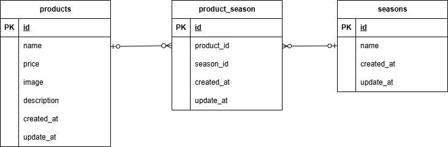

# 環境構築

1. 下記URLでプロジェクトをクローンする
      ```
      https://github.com/akari3800/mogitate.git
      ```
1. 下記コマンドでDockerをビルドする
      ```
      docker-compose up -d --build
      ```

# Laravel環境構築

- 以下の手順で環境構築を行う
      
      docker-compose exec php bash
      composer install
      cp .env.example .env　♯環境変数を適宜変更
      php artisan key:generate
      php artisan migrate
      php artisan db:seed

# 開発環境

- 商品一覧画面: http://localhost:8080/products
- 商品詳細画面: http://localhost:8080/products/detail/{:productId}
- 商品登録画面: http://localhost:8080/products/register
- phpMyAdmin: http://localhost:8081

# 使用技術(実行環境）

- PHP 8.1.x
- Laravel　8.83.29
- jQuery 
- MySQL 8.0.26
- nginx 1.21.1

# ER図


